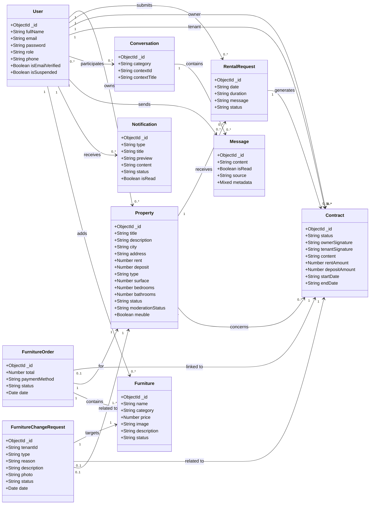

# ImmoSmart Class Diagram

This diagram is based on the backend domain models in `backend/src/models/`.

To render this file in Markdown, keep the fenced `mermaid` block as-is.
If you use Mermaid Live Editor or any Mermaid-only renderer, copy only the diagram code inside the fence, not the page title or explanatory text.

## Mermaid UML Class Diagram



## Raw Mermaid Code

Copy only the content below into Mermaid Live Editor:

```text
classDiagram
direction LR

class User {
  +ObjectId _id
  +String fullName
  +String email
  +String password
  +String role
  +String phone
  +Boolean isEmailVerified
  +Boolean isSuspended
}

class Property {
  +ObjectId _id
  +String title
  +String description
  +String city
  +String address
  +Number rent
  +Number deposit
  +String type
  +Number surface
  +Number bedrooms
  +Number bathrooms
  +String status
  +String moderationStatus
  +Boolean meuble
}

class RentalRequest {
  +ObjectId _id
  +String date
  +String duration
  +String message
  +String status
}

class Contract {
  +ObjectId _id
  +String status
  +String ownerSignature
  +String tenantSignature
  +String content
  +Number rentAmount
  +Number depositAmount
  +String startDate
  +String endDate
}

class Conversation {
  +ObjectId _id
  +String category
  +String contextId
  +String contextTitle
}

class Message {
  +ObjectId _id
  +String content
  +Boolean isRead
  +String source
  +Mixed metadata
}

class Notification {
  +ObjectId _id
  +String type
  +String title
  +String preview
  +String content
  +String status
  +Boolean isRead
}

class Furniture {
  +ObjectId _id
  +String name
  +String category
  +Number price
  +String image
  +String description
  +String status
}

class FurnitureOrder {
  +ObjectId _id
  +Number total
  +String paymentMethod
  +String status
  +Date date
}

class FurnitureChangeRequest {
  +ObjectId _id
  +String tenantId
  +String type
  +String reason
  +String description
  +String photo
  +String status
  +Date date
}

User "1" --> "0..*" Property : owns
User "1" --> "0..*" RentalRequest : submits
Property "1" --> "0..*" RentalRequest : receives

RentalRequest "1" --> "0..1" Contract : generates
Property "1" --> "0..*" Contract : concerns
User "1" --> "0..*" Contract : owner
User "1" --> "0..*" Contract : tenant

Conversation "1" --> "0..*" Message : contains
User "0..*" --> "0..*" Conversation : participates
User "1" --> "0..*" Message : sends

User "1" --> "0..*" Notification : receives

User "1" --> "0..*" Furniture : adds
FurnitureOrder "0..1" --> "1" Contract : linked to
FurnitureOrder "1" --> "1" Property : for
FurnitureOrder "1" --> "1..*" Furniture : contains

FurnitureChangeRequest "1" --> "1" Furniture : targets
FurnitureChangeRequest "0..1" --> "1" Contract : related to
FurnitureChangeRequest "0..1" --> "1" Property : related to
```

## Main interpretation

- `User` is the central actor of the system with 3 roles: `admin`, `owner`, and `tenant`.
- `Property` belongs to an `owner`.
- `RentalRequest` links a `tenant` to a `property`.
- `Contract` is created from one accepted `RentalRequest`.
- `Conversation` and `Message` manage communication between users.
- `Notification` is sent to one recipient user.
- `FurnitureOrder` and `FurnitureChangeRequest` extend the rental workflow with furnishing operations.

## Important modeling note

Some current models use plain strings instead of MongoDB references for a few links:

- `FurnitureOrder.tenant`
- `FurnitureOrder.owner`
- `FurnitureChangeRequest.tenantId`
- `Conversation.contextId`

For a report or presentation, you can still show them as associations, but if your teacher asks for strict persistence modeling, mention that these are implemented as string-based references in the current codebase.
